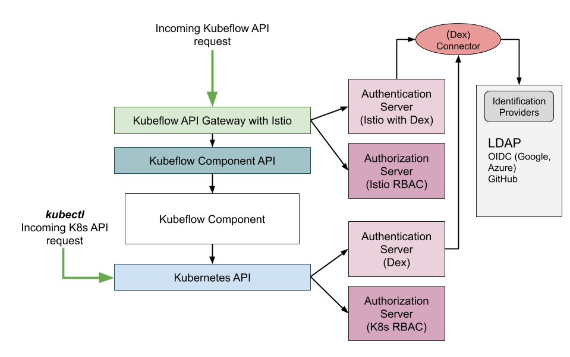

# Kubeflow Authentication and Authorization Prototype

## High Level Diagram

## Create SSL Certificates

This example is going to require three domains:  
- dex.example.org: For the authentication server
- login.example.org: For the client application for authentication through dex (optional)
- ldap-admin.example.org: For the admin interface to create LDAP users and groups (optional)

**Note**: Replace *example.org* with your own domain.  

With your trusted certificate signing authority, please create a certificate for the above domains.

### Why Self Signed SSL Certs will not work

Authentication through OIDC in Kubernetes does work with self signed certificates since the `--oidc-ca-file` parameter in the Kubernetes API server allows for adding a trusted CA for your authentication server.

Though Istio's authentication policy parameter `jwksUri` for [End User Authentication](https://istio.io/docs/ops/security/end-user-auth/) does [not allow self signed certificates](https://github.com/istio/istio/issues/7290#issuecomment-420748056).

Please generate certificates with a trusted authority for enabling this example or follow this [work-around](#self-signed-work-around).

## Authentication Server Setup

### Setup Post Certificate Creation

`kubectl create ns auth`

`kubectl create secret tls dex.example.com.tls --cert=ssl/cert.pem --key=ssl/key.pem -n auth`

Replace `dex.example.com.tls` with your own domain.

### Editing Overlay File Values

Follow instructions [here](overlays/README.md) to edit Kustomize overlays in `overlays/prototype` to setup a Dex server with LDAP IdP and a client application (dex-k8s-authenticator) for issuing keys for Dex.

### Apply Kustomize Configs

`kustomize build overlays/prototype | kubectl apply -f -`
